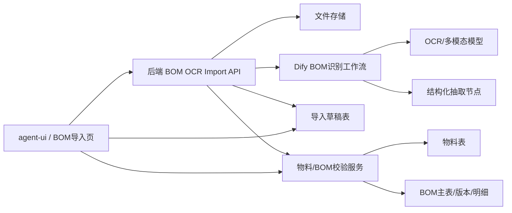

# BOM 图纸 OCR 识别导入方案

## 背景

当前系统已有物料、BOM 主表、BOM 版本、BOM 明细等基础能力。新增需求是：用户上传 BOM 图纸文件，通过 OCR/大模型/Dify 工作流识别图纸中的产品信息和明细表，经过人工确认后导入系统 BOM。

图纸来源可能是图片、PDF 或扫描件，内容通常包含：

- 标题区：产品名称、产品型号、出厂编号、部件图号、部件版本、设计编号、日期、重量、总数量、总行数等。
- BOM 明细表：序号、图号、名称、数量、规格、重量、配件编号、推荐厂家、备注等。

## 目标

第一阶段目标不是全自动入库，而是形成可控的“识别草稿 -> 人工校验 -> 导入 BOM”的闭环。

必须解决：

- 支持上传图片/PDF。
- 调用 Dify 完成 OCR 和结构化抽取。
- 将抽取结果落为 BOM 导入草稿。
- 前端展示识别进度、原图、识别结果、校验问题。
- 用户确认后创建或更新 BOM 主表、BOM 版本和 BOM 明细。
- 导入前做物料匹配、必填项校验、重复行校验和异常提示。

暂不解决：

- 复杂多层 BOM 自动展开。
- CAD/结构化工程图原生解析。
- 无人审核直接入库。
- 自动创建所有缺失物料。

## 核心原则

1. AI 只负责识别和建议，不直接写正式 BOM。
2. 后端是唯一入库边界，Dify 返回结构必须先被后端校验。
3. 导入草稿要可追溯，保留原始文件、Dify 原始输出、规范化结果和校验问题。
4. 前端必须让用户能修改识别结果，不能把 OCR 结果当成事实。
5. 物料匹配优先使用已有物料编码，其次图号/配件编号/名称模糊匹配，低置信度必须人工确认。

## 建议架构



## 用户流程

1. 用户进入“BOM 图纸导入”。
2. 上传图片或 PDF。
3. 前端发起识别任务。
4. 后端保存文件，调用 Dify 工作流。
5. 前端通过 SSE 显示处理步骤：
   - 文件上传完成
   - 图纸 OCR
   - 标题区识别
   - 明细表识别
   - 物料匹配
   - 校验完成
6. 后端生成导入草稿。
7. 前端展示草稿：
   - 左侧原图/PDF 预览。
   - 右侧基础信息表单。
   - 下方 BOM 明细表格。
   - 高亮缺失、低置信度、重复、物料未匹配行。
8. 用户修正草稿并点击“校验”。
9. 校验通过后点击“导入 BOM”。
10. 后端创建或更新 BOM 主表、版本和明细。

## Dify 工作流建议

Dify 节点命名延续 Agent V2 的节点规范：

- `[输入] 文件接收`
- `[OCR] 图纸文字识别`
- `[模型] 标题区结构化`
- `[模型] BOM明细结构化`
- `[校验] 字段规范化`
- `[回答] 识别结果回复`

建议 Dify 最终输出一个稳定 JSON：

```json
{
  "version": "1.0",
  "document": {
    "title": "换刀机器人本体总成部件明细",
    "productName": "1588",
    "productModel": "CTD10850E-560",
    "drawingNo": "1588-003-5200-9000",
    "revision": "A",
    "designNo": "0004852097",
    "date": "2026-03-26",
    "totalRows": 56,
    "quantity": 1.0,
    "weight": 2412.85
  },
  "items": [
    {
      "lineNo": 21,
      "drawingNo": "",
      "itemName": "角度编码器",
      "quantity": 4,
      "spec": "AFM60I-S4AL262144...",
      "unitWeight": null,
      "totalWeight": 0,
      "componentCode": "6000043663",
      "manufacturer": "",
      "remark": "",
      "confidence": 0.86
    }
  ]
}
```

Dify 只返回结构化识别结果，不返回正式 BOM ID，不直接决定数据库行为。

## 后端接口建议

新增独立模块，不混入现有 Agent Chat：

- `POST /mes/base/bomImport/upload`
  - 上传图片/PDF，返回 `importId`。
- `POST /mes/base/bomImport/{importId}/recognize`
  - 启动 Dify 识别任务，可 SSE 返回进度。
- `GET /mes/base/bomImport/{importId}`
  - 获取草稿详情。
- `PUT /mes/base/bomImport/{importId}`
  - 保存用户修改后的草稿。
- `POST /mes/base/bomImport/{importId}/validate`
  - 校验草稿，返回问题列表。
- `POST /mes/base/bomImport/{importId}/commit`
  - 导入正式 BOM。

## 后端数据表建议

### bom_import_task

- id
- file_name
- file_url
- file_type
- status：uploaded / recognizing / recognized / validating / ready / imported / failed
- dify_conversation_id
- dify_message_id
- raw_result_json
- normalized_json
- error_message
- create_by / create_time / update_by / update_time

### bom_import_item

- id
- import_id
- line_no
- drawing_no
- item_name
- quantity
- spec
- unit_weight
- total_weight
- component_code
- manufacturer
- remark
- confidence
- matched_material_id
- matched_material_code
- match_status：matched / ambiguous / missing / ignored
- issue_level
- issue_message

## 字段映射

### 标题区到 BOM 主表/版本

- 部件图号 / 产品型号 -> `BomMaster.bomCode` 候选。
- 产品名称 -> `BomMaster.parentItemName` 候选。
- 部件图号 -> `Material.drawingNo` 或母件编码候选。
- 部件版本 -> `BomVersion.versionCode`。
- 总数量 -> `BomVersion.baseQty`。
- 日期 -> `BomVersion.effectiveDate`。
- 来源系统 -> 固定为 `OCR_IMPORT`。

具体 BOM 编码规则需要业务确认。第一阶段建议默认用 `部件图号 + 版本`，允许用户修改。

### 明细表到 BOM 明细

- 序号 -> `BomItem.lineNo`
- 配件编号 / 图号 -> 物料匹配候选
- 名称 -> `BomItem.componentItemName`
- 数量 -> `BomItem.componentQty`
- 规格 -> `BomItem.componentItemSpec`
- 单位 -> 默认从匹配物料带出，未匹配时默认 `PCS` 或空，需人工确认
- 父件编码 -> 导入时使用 BOM 主表母件编码
- 发料方式、虚拟件、MRP 展开 -> 使用系统默认值

## 校验规则

必须阻断导入：

- 没有 BOM 编码。
- 没有版本号。
- 没有母件物料或母件编码。
- 明细行号为空或重复。
- 明细数量为空或小于等于 0。
- 明细未匹配到物料，且用户未选择“允许创建/忽略”。

允许警告：

- OCR 置信度低。
- 图号为空但配件编号存在。
- 重量为空。
- 推荐厂家为空。
- 总行数与识别明细数量不一致。

## 前端设计建议

第一阶段可以不放进现有 Agent Chat，而是做一个独立的 BOM 导入页面：

- 顶部：上传区、识别按钮、任务状态。
- 左侧：图片/PDF 预览。
- 右侧：BOM 基础信息表单。
- 下方：可编辑明细表格。
- 侧边：校验问题列表。
- 底部：保存草稿、重新识别、校验、导入 BOM。

可以复用 Agent UI 的经验：

- SSE 进度展示复用 ThinkingSteps 思路。
- Dify 事件规范复用 `[OCR]`、`[模型]`、`[校验]` 节点命名。
- 结构化结果不作为 chat message 展示，而是作为业务草稿展示。

## 实施阶段

### P0：需求确认

- 确认 BOM 编码生成规则。
- 确认未匹配物料的处理方式：阻断、自动创建、或人工选择。
- 确认 PDF 是否只支持图片型 PDF，还是也要解析文字型 PDF。
- 确认 Dify 文件上传能力和模型能力。

### P1：识别草稿闭环

- 新建导入任务表和明细表。
- 新增上传、识别、查询接口。
- Dify 工作流输出稳定 JSON。
- 后端解析并落草稿。
- 前端展示草稿。

### P2：校验与导入

- 物料匹配服务。
- 草稿校验服务。
- 人工修正保存。
- 导入 BOM 主表、版本、明细。
- 导入后跳转 BOM 详情。

### P3：增强

- 多页 PDF 分页识别。
- 原图区域定位和行级高亮。
- 批量识别。
- 识别历史和失败重试。
- 自动创建缺失物料的审批流。

## 风险

- 扫描件质量差会导致行号、数量、编码误识别。
- 表格跨页时需要合并上下文。
- Dify 输出必须严格 JSON，否则后端解析会不稳定。
- OCR 结果不应直接覆盖正式 BOM，必须保留人工确认。
- 图纸中的“配件编号”和系统“物料编码”是否等价，需要业务确认。

## 推荐第一步

先做 P0/P1：上传一个图纸，Dify 返回稳定 JSON，后端生成草稿，前端能展示和编辑。不要一开始就做自动入库。
